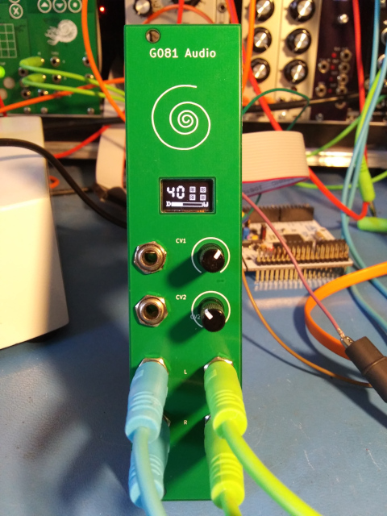

# g081_audio

A Eurorack reverb module based on the STM32G081

## What it is

The G081 Audio module is an extremely simplified audio effects processor for Eurorack that's designed specifically to run the original MIDIVerb algorithms. Its audio conversion resolution is comparable to the original MIDIVerb and its processing power and memory capacity are just enough to handle the requirements of the algorithms. Essentially it is a proof-of-concept in minimalism.

## Background

In 2021 I was involved in a project to reverse-engineer the MIDIVerb which I've documented over here: [MIDIVerb_RE](https://github.com/emeb/MIDIVerb_RE). Once that effort was wrapped up I had some curiosity about how well those algorithms could be implemented on modern low-cost microprocessors so I did some tests that showed the initial emulation approach was too costly to run well on low-spec processors because there was considerable overhead in the the interpretation approach that was used. The alternative was to "compile" the algorithms into equivalent C code which could then be further optimized into fast machine code by high quality C compilers available today. This is the method used in the G081 Audio module.

## Hardware Features

The hardware of the module includes the following features:

- STM32G081KB Arm Cortex M0+ microcontroller
  - 64MHz
  - 128kB Flash
  - 36kB SRAM
  - 12-bit ADC with multipexed inputs
  - 2x 12-bit DACs
  - I2S, I2C and SPI ports
- PT8211 I2S stereo DAC
  - choice of on-chip DAC or I2S DAC for Euro-level audio outputs 
- Optional SPI flash chip (up to 32MB capacity)
- 12MHz crystal oscillator
- 64x32 I2C OLED display
- 2 CV inputs (+/-5V range with offset pots)
- Stereo audio inputs (12-bit resolution, +/-7V range)
- Stereo audio outputs (12- or 16-bit resolution, +/-7V range)
- 3.3V logic-level full-duplex serial port for diagnostics
- 6HP wide
- Standard 16-pin Euro power jack w/ shroud and reverse protection.

The main board has components on both sides - pots, jacks and OLED display on the front and all the remaining parts, including the Eurorack power jack on the back. The board has two "solder blob" type jumpers which allow selection of the output source - either the DACs internal to the STM32G081 or the PT8211 I2S DAC - the present firmware assumes the PT8211 is used. A footprint for an optional SPI flash chip is available although the present firmware does not require it.

## Firmware Features

The primary MIDIVerb software provides these features:

- 63 Original MIDIVerb algorithms selected by CV1
  - Smooth muting during program changes.
  - MIDIVerb algorithm number displayed on OLED.
  - Characteristics (duration, type) temporarily shown on display during changes.
- Wet/Dry mixing via CV2
  - Mix setting displayed on OLED.
- Input / Ouput level indicators
  - Low / normal / Clip level displayed as grayscale
- Compile-time option for OLED blanking.

## Design Collateral

This repository contains both Hardware and Firmware design info. Please refer to the README.md files withing the respective directories for further details.

[Hardware](./Hardware/README.md)

[Firmware](./Firmware/README.md)

## Build Notes

Since this project was first released there has been at least one alternate layout built by others in the community which unfortunately suffered from severe noise caused by the OLED which leaked into the audio path. The original layout provided here does not suffer from that problem so it's worthwhile noting that if you do choose to respin this design it would be wise to observe good layout principles:
- Maintain as contiguous a ground plane as is possible
- Think about the paths that supply and return currents are forced to take through your layout and how to keep the digital and analog paths separate.

In particular, the OLED is prone to generating strong current spikes when it is refreshing any active pixels and the PT8211 I2S DAC has very poor power supply rejection so when those two devices are present in the same design you must use care to keep them from fighting. I've provided a compile-time option to blank the OLED after a few seconds which can work around this issue but with good layout this should not be necessary.